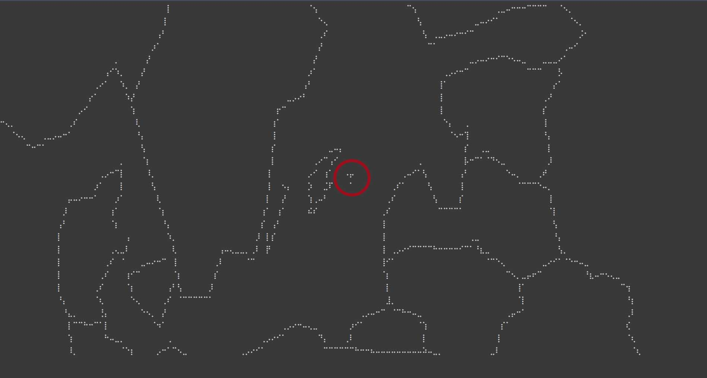

# Where is..

If you have a beloved Person that travels via ship and you don't want to use a website with all the foo for following the journey.. this is what you need.
In Line 11 you find the ship id, enter the id from https://www.marinetraffic.com/ (click on the ship you need and copy the id from url)

The Map is drawn with the ship in the center. The Ship looks like a T.

If the zooming is not enough or too much go to line 40 and change the scaling

## ToDo
adding a color for the ship
